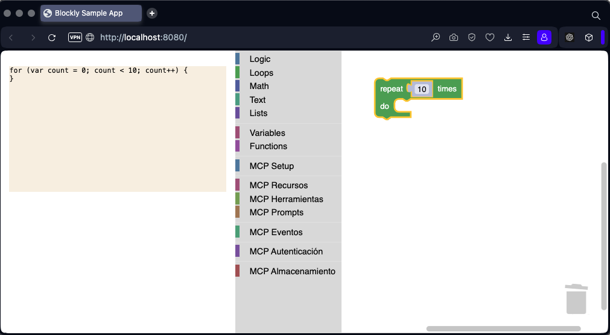

Pues venga, manos a la obra. Crea una nueva toolbox que extienda la existente y añada los nodos que necesitamos según lo definido.

# Expansión de la la [toolbox](../src/toolbox.js)

Primero separando los [bloques de Blockly](../src/toolbox-blockly/). Y agregar los [bloques MCP](../src/toolbox-mcp/):

-   **MCP Setup**: Bloques para configurar servidores/clientes y transportes
-   **MCP Recursos**: Bloques para definir y manipular recursos
-   **MCP Herramientas**: Bloques para definir y utilizar herramientas
-   **MCP Prompts**: Bloques para crear y manejar prompts
-   **MCP Eventos**: Bloques para notificaciones y manejo de eventos
-   **MCP Autenticación**: Bloques para configuración OAuth y permisos
-   **MCP Almacenamiento**: Bloques para persistencia de datos

Esta toolbox está estructurada para implementar los [5 proyectos tutorial](./02_create_a_mark_in_the_horizon.md) que definimos anteriormente, permitiendo crear tanto el servidor de eco básico como los proyectos más complejos con autenticación y almacenamiento persistente.

```ts
export const toolbox = {
    kind: "categoryToolbox",
    contents: [
        ...tcommon,
		{
			kind: "sep",
		},
        ...tsetup,
		{
			kind: "sep",
		},
        ...tresources,
        ...ttools,
        ...tprompts,
		{
			kind: "sep",
		},
        ...tevents,
		{
			kind: "sep",
		},
        ...tauth,
		{
			kind: "sep",
		},
        ...tstorage,
    ],
};
```



Ahora necesitarás definir las implementaciones de estos bloques personalizados, lo cual implicará crear tanto la definición de los bloques como los generadores de código correspondientes. ¿Quieres que comience con alguna implementación específica?