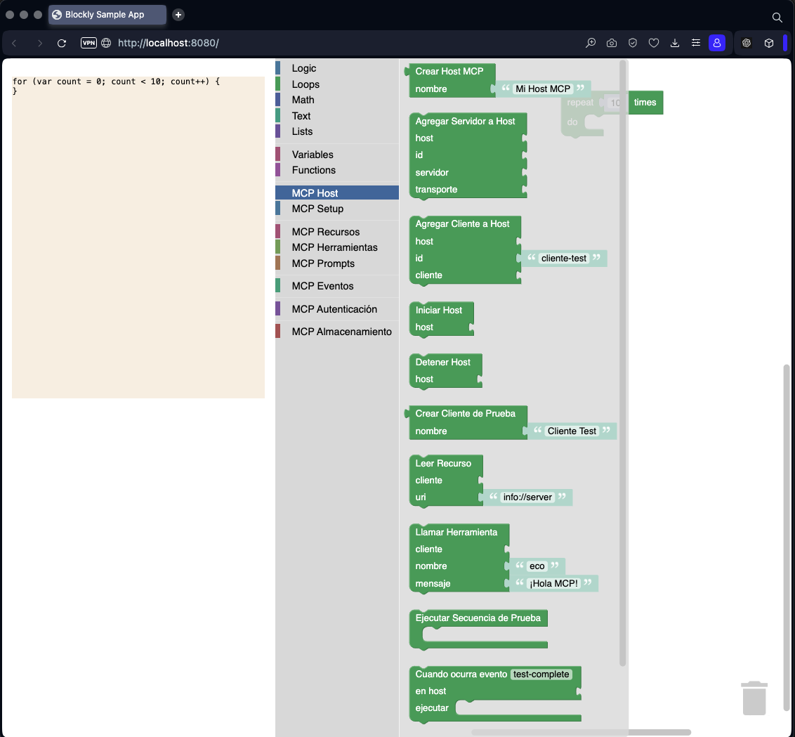

Me gustaría empezar a crear los bloques para el Proyecto 1, teniendo en cuenta tanto la definición original, como las dos revisiones. Puedes ayudarme a crear los bloques implicados en el proyecto para crear un host que tiene al menos un cliente que usa la herramienta eco del servidor mcp.



Con estos [generators/javascript](../src/generators/javascript) y estos [bloques](../src/blocks/), implementados, podrías crear el ejemplo del Proyecto 1 con Host MCP:

```xml
<xml xmlns="https://developers.google.com/blockly/xml">
  <variables>
    <variable id="host">host</variable>
    <variable id="servidor">servidor</variable>
    <variable id="transporte">transporte</variable>
    <variable id="clienteTest">clienteTest</variable>
  </variables>
  
  <!-- Crear Host MCP -->
  <block type="variables_set" id="set_host">
    <field name="VAR" id="host">host</field>
    <value name="VALUE">
      <block type="mcp_create_host">
        <value name="NAME">
          <block type="text">
            <field name="TEXT">Host de Pruebas MCP</field>
          </block>
        </value>
      </block>
    </value>
    <next>
      <!-- Crear Servidor MCP -->
      <block type="variables_set" id="set_server">
        <field name="VAR" id="servidor">servidor</field>
        <value name="VALUE">
          <block type="mcp_create_server">
            <value name="NAME">
              <block type="text">
                <field name="TEXT">Servidor Eco</field>
              </block>
            </value>
            <value name="VERSION">
              <block type="text">
                <field name="TEXT">1.0.0</field>
              </block>
            </value>
          </block>
        </value>
        <next>
          <!-- Configurar transporte -->
          <block type="variables_set" id="set_transport">
            <field name="VAR" id="transporte">transporte</field>
            <value name="VALUE">
              <block type="mcp_stdio_transport_server"></block>
            </value>
            <next>
              <!-- Definir recurso info -->
              <block type="mcp_define_resource_static">
                <value name="NAME">
                  <block type="text">
                    <field name="TEXT">info</field>
                  </block>
                </value>
                <value name="URI">
                  <block type="text">
                    <field name="TEXT">info://server</field>
                  </block>
                </value>
                <statement name="CALLBACK">
                  <block type="mcp_return_resource_content">
                    <value name="URI">
                      <block type="text">
                        <field name="TEXT">uri</field>
                      </block>
                    </value>
                    <value name="TEXT">
                      <block type="text">
                        <field name="TEXT">Servidor eco MCP v1.0</field>
                      </block>
                    </value>
                  </block>
                </statement>
                <next>
                  <!-- Definir herramienta eco -->
                  <block type="mcp_define_tool">
                    <value name="NAME">
                      <block type="text">
                        <field name="TEXT">eco</field>
                      </block>
                    </value>
                    <statement name="CONFIG">
                      <block type="mcp_tool_description">
                        <value name="DESCRIPTION">
                          <block type="text">
                            <field name="TEXT">Repite el mensaje enviado</field>
                          </block>
                        </value>
                        <next>
                          <block type="mcp_tool_parameter">
                            <value name="NAME">
                              <block type="text">
                                <field name="TEXT">mensaje</field>
                              </block>
                            </value>
                            <field name="TYPE">string</field>
                            <next>
                              <block type="mcp_tool_callback">
                                <statement name="CALLBACK_BODY">
                                  <block type="mcp_return_tool_response">
                                    <value name="TYPE">
                                      <block type="text">
                                        <field name="TEXT">texto</field>
                                      </block>
                                    </value>
                                    <value name="TEXT">
                                      <block type="text_join">
                                        <mutation items="2"></mutation>
                                        <value name="ADD0">
                                          <block type="text">
                                            <field name="TEXT">El servidor dice: </field>
                                          </block>
                                        </value>
                                        <value name="ADD1">
                                          <block type="mcp_get_parameter_value">
                                            <value name="PARAM">
                                              <block type="text">
                                                <field name="TEXT">mensaje</field>
                                              </block>
                                            </value>
                                          </block>
                                        </value>
                                      </block>
                                    </value>
                                  </block>
                                </statement>
                              </block>
                            </next>
                          </block>
                        </next>
                      </block>
                    </statement>
                    <next>
                      <!-- Agregar servidor al host -->
                      <block type="mcp_host_add_server">
                        <value name="HOST">
                          <block type="variables_get">
                            <field name="VAR" id="host">host</field>
                          </block>
                        </value>
                        <value name="SERVER_ID">
                          <block type="text">
                            <field name="TEXT">servidor-eco</field>
                          </block>
                        </value>
                        <value name="SERVER">
                          <block type="variables_get">
                            <field name="VAR" id="servidor">servidor</field>
                          </block>
                        </value>
                        <value name="TRANSPORT">
                          <block type="variables_get">
                            <field name="VAR" id="transporte">transporte</field>
                          </block>
                        </value>
                        <next>
                          <!-- Crear cliente de prueba -->
                          <block type="variables_set">
                            <field name="VAR" id="clienteTest">clienteTest</field>
                            <value name="VALUE">
                              <block type="mcp_create_test_client">
                                <value name="NAME">
                                  <block type="text">
                                    <field name="TEXT">Cliente Test</field>
                                  </block>
                                </value>
                              </block>
                            </value>
                            <next>
                              <!-- Agregar cliente al host -->
                              <block type="mcp_host_add_client">
                                <value name="HOST">
                                  <block type="variables_get">
                                    <field name="VAR" id="host">host</field>
                                  </block>
                                </value>
                                <value name="CLIENT_ID">
                                  <block type="text">
                                    <field name="TEXT">cliente-test</field>
                                  </block>
                                </value>
                                <value name="CLIENT">
                                  <block type="variables_get">
                                    <field name="VAR" id="clienteTest">clienteTest</field>
                                  </block>
                                </value>
                                <next>
                                  <!-- Configurar manejo de eventos -->
                                  <block type="mcp_host_on_event">
                                    <field name="EVENT">test-complete</field>
                                    <value name="HOST">
                                      <block type="variables_get">
                                        <field name="VAR" id="host">host</field>
                                      </block>
                                    </value>
                                    <statement name="HANDLER">
                                      <block type="mcp_host_stop">
                                        <value name="HOST">
                                          <block type="variables_get">
                                            <field name="VAR" id="host">host</field>
                                          </block>
                                        </value>
                                      </block>
                                    </statement>
                                    <next>
                                      <!-- Iniciar host -->
                                      <block type="mcp_host_start">
                                        <value name="HOST">
                                          <block type="variables_get">
                                            <field name="VAR" id="host">host</field>
                                          </block>
                                        </value>
                                        <next>
                                          <!-- Ejecutar secuencia de prueba -->
                                          <block type="mcp_test_run_sequence">
                                            <statement name="SEQUENCE">
                                              <!-- Probar recurso -->
                                              <block type="mcp_test_read_resource">
                                                <value name="CLIENT">
                                                  <block type="variables_get">
                                                    <field name="VAR" id="clienteTest">clienteTest</field>
                                                  </block>
                                                </value>
                                                <value name="URI">
                                                  <block type="text">
                                                    <field name="TEXT">info://server</field>
                                                  </block>
                                                </value>
                                                <next>
                                                  <!-- Probar herramienta -->
                                                  <block type="mcp_test_call_tool">
                                                    <value name="CLIENT">
                                                      <block type="variables_get">
                                                        <field name="VAR" id="clienteTest">clienteTest</field>
                                                      </block>
                                                    </value>
                                                    <value name="TOOL_NAME">
                                                      <block type="text">
                                                        <field name="TEXT">eco</field>
                                                      </block>
                                                    </value>
                                                    <value name="MESSAGE">
                                                      <block type="text">
                                                        <field name="TEXT">¡Hola MCP!</field>
                                                      </block>
                                                    </value>
                                                    <next>
                                                      <!-- Emitir evento de completado -->
                                                      <block type="mcp_host_emit_event">
                                                        <value name="HOST">
                                                          <block type="variables_get">
                                                            <field name="VAR" id="host">host</field>
                                                          </block>
                                                        </value>
                                                        <value name="EVENT_NAME">
                                                          <block type="text">
                                                            <field name="TEXT">test-complete</field>
                                                          </block>
                                                        </value>
                                                        <value name="DATA">
                                                          <block type="text">
                                                            <field name="TEXT">{success: true}</field>
                                                          </block>
                                                        </value>
                                                      </block>
                                                    </next>
                                                  </block>
                                                </next>
                                              </block>
                                            </statement>
                                          </block>
                                        </next>
                                      </block>
                                    </next>
                                  </block>
                                </next>
                              </block>
                            </next>
                          </block>
                        </next>
                      </block>
                    </next>
                  </block>
                </next>
              </block>
            </next>
          </block>
        </next>
      </block>
    </next>
  </block>
</xml>
```