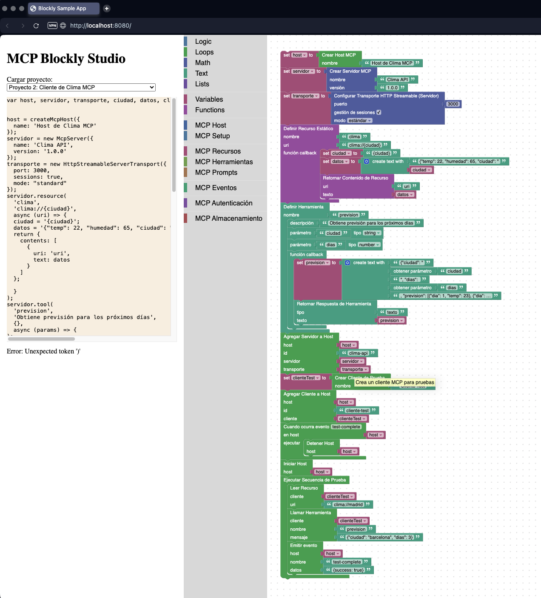
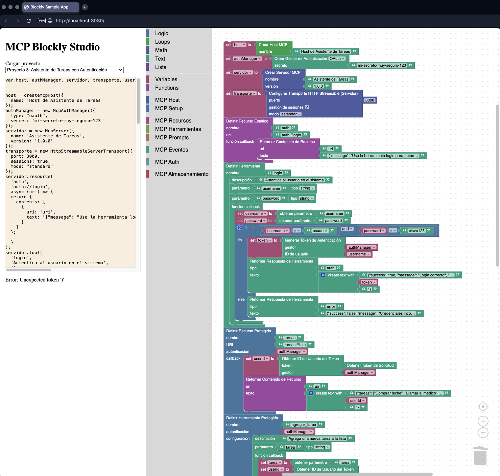
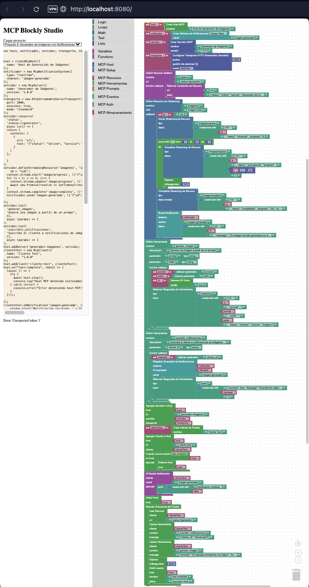

Parece que hemos conseguido hacerlo!!! ¿Vamos ahora a proceder de forma similar para crear el tutorial 2?

Diferencias Principales con el Tutorial 1
-----------------------------------------

[src/tutorials/tutorial2.js](../src/tutorials/tutorial2.js)

Este segundo tutorial se diferencia del primero en varios aspectos clave:

1.  **Transporte HTTP Streamable**: Utiliza un transporte HTTP en lugar de Stdio, lo que representa un escenario más realista para servicios web.

2.  **Recursos con Plantillas**: Implementa un recurso parametrizado (`clima://{ciudad}`) que permite acceder a datos específicos según el parámetro.

3.  **Herramienta con Múltiples Parámetros**: La herramienta `prevision` acepta tanto la ciudad como el número de días, demostrando una funcionalidad más compleja.

4.  **Simulación de API Externa**: Aunque en el ejemplo simulamos la llamada a la API externa (en un entorno real haríamos una llamada a `fetch` o similar), el concepto se mantiene.

Verificación y Prueba
---------------------

Con estos cambios, ahora podrás seleccionar el "Proyecto 2: Cliente de Clima MCP" en el selector de proyectos y cargará automáticamente este flujo de trabajo. La secuencia de prueba:

1.  Leerá el recurso de clima para Madrid
2.  Llamará a la herramienta de previsión para Barcelona con 3 días
3.  Emitirá un evento para completar la prueba

Al igual que con el Tutorial 1, todo se ejecuta en un Host MCP que coordina la comunicación entre el servidor y el cliente de prueba.

Siguientes Pasos
----------------

Una vez implementado el Tutorial 2, podríamos continuar con el Tutorial 3 (Asistente de Tareas con Autenticación), que incorpora conceptos más avanzados como la autenticación OAuth y la protección de recursos.

¿Te gustaría que procedamos con la implementación del Tutorial 3 o prefieres revisar y probar primero el Tutorial 2?

Características del Tutorial 3
------------------------------

Este tercer tutorial introduce conceptos importantes del protocolo MCP:

1.  **Autenticación**: Implementa un sistema de autenticación completo con login y generación de tokens.

2.  **Recursos Protegidos**: Muestra cómo crear recursos que solo pueden ser accedidos por usuarios autenticados.

3.  **Herramientas Protegidas**: Implementa herramientas que requieren autenticación para ser utilizadas.

4.  **Gestión de Sesiones**: Utiliza un transporte HTTP Streamable con sesiones habilitadas para mantener el estado de autenticación.

5.  **Flujo de Autenticación**: La secuencia de prueba muestra un flujo completo: intento de acceso sin autenticación, login, y acceso con autenticación.

Con estos cambios, tendrás implementado el tercer tutorial que demuestra las capacidades de autenticación y protección de recursos en MCP.

Características del Tutorial 4
------------------------------

El Tutorial 4 (Generador de Imágenes con Notificaciones) introduce varios conceptos avanzados del protocolo MCP:

1.  **Streaming de Datos**: Implementa un flujo de comunicación bidireccional para mostrar el progreso de generación de imágenes en tiempo real.

2.  **Sistema de Notificaciones**: Permite a los clientes suscribirse a eventos específicos y recibir notificaciones cuando ocurren.

3.  **Recursos Asíncronos**: Demuestra cómo manejar operaciones de larga duración, como la generación de imágenes, mediante recursos de streaming.

4.  **Herramientas con Respuestas de Streaming**: Muestra cómo las herramientas pueden devolver resultados preliminares y finales a través del tiempo.

5.  **Gestión de Eventos del Cliente**: Configura manejadores de eventos para que los clientes procesen las notificaciones recibidas.

Con esta implementación completa, los usuarios podrán aprender a crear un sistema de generación de imágenes que proporcione actualizaciones de progreso en tiempo real y notifique a los usuarios cuando sus imágenes están listas.