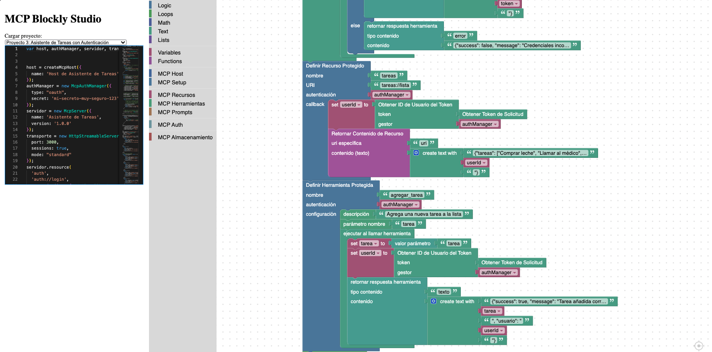
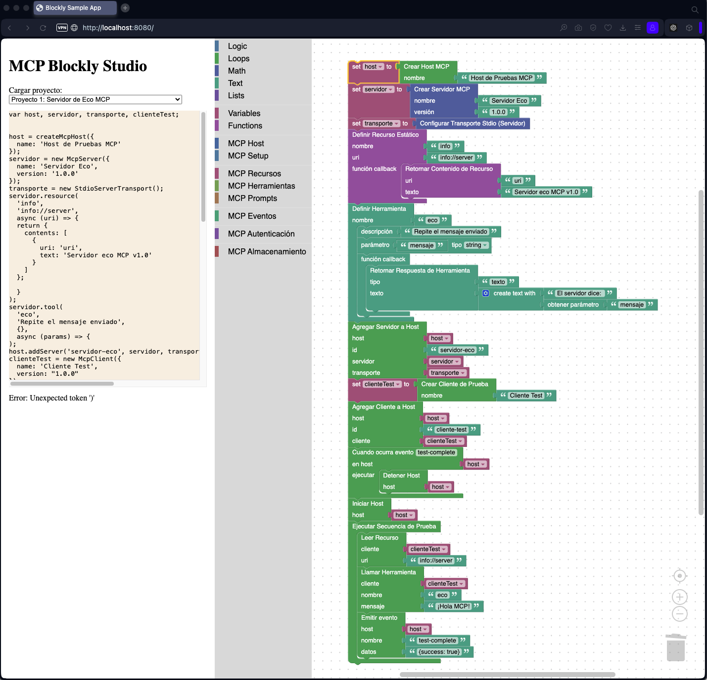

[English](./README-en.md)

MCP Blockly Studio
==================

- [time-line.md](./time-line.md) Detalles y white paper.
- [Repo](https://github.com/jsanchezamai/blockly-mcp-common-palette)
- [Editor Showcase](https://jsanchezamai.github.io/blockly-mcp-common-palette)
- [Editor Blockly](https://jsanchezamai.github.io/blockly-mcp-common-palette/dist/)

Un entorno de programación visual para crear aplicaciones basadas en el Protocolo de Contexto de Modelo (MCP) utilizando Blockly de Google.

Descripción general
-------------------

MCP Blockly Studio proporciona un enfoque basado en bloques para construir aplicaciones que siguen la [especificación del Protocolo de Contexto de Modelo](). El proyecto utiliza el [SDK de TypeScript para MCP]() para crear servidores, clientes y otros componentes compatibles.

Los usuarios pueden:

-   Crear servidores MCP con varios recursos y herramientas
-   Construir clientes que interactúan con servidores MCP
-   Configurar diferentes tipos de transporte (stdio, HTTP con streaming)
-   Implementar autenticación, notificaciones y solicitudes
-   Probar con proyectos de tutorial incorporados
-   Exportar el código JavaScript generado

Proyectos de tutorial
---------------------

MCP Blockly Studio incluye varios proyectos de tutorial:

1.  **Servidor Eco**: Un servidor MCP básico que devuelve los mensajes enviados por los clientes
2.  **Cliente del Clima**: Un cliente MCP que se conecta a una API de servicio meteorológico
3.  **Asistente de Tareas**: Un servidor de gestión de tareas con autenticación OAuth
4.  **Generador de Imágenes**: Un servidor que genera imágenes con notificaciones de progreso

Primeros pasos
--------------

1.  Clona este repositorio
2.  Ejecuta `npm install` para instalar las dependencias
3.  Ejecuta `npm run start` para iniciar el servidor de desarrollo
4.  Selecciona un proyecto de tutorial del menú desplegable o crea uno nuevo desde cero
5.  Modifica los bloques en el espacio de trabajo
6.  Visualiza el código JavaScript generado en el panel del editor
7.  Descarga el código usando el botón "Descargar Código"

Estructura del proyecto
-----------------------

- [time-line.md](./time-line.md) es el registro principal de cambios para obtener una visión general del proyecto.
-   [src]() - Código fuente de la aplicación
    -   `blocks/` - Definiciones de bloques personalizados de Blockly
    -   `toolbox-mcp/` - Categorías de la caja de herramientas específicas para MCP
    -   `generators/` - Generadores de código para traducir bloques a JavaScript
- [PICS](./PICS/) - Capturas de pantalla e imágenes del proyecto
- [PROMPT_HISTORY](./PROMPT_HISTORY/) se encuentra la teoría en profundidad para la línea temporal.
- [mcp-ts-sdk](https://github.com/modelcontextprotocol/typescript-sdk) - SDK de TypeScript para MCP (incluido como dependencia)

Construido con
--------------

-   [Blockly]()
-   [Editor Monaco]()
-   [SDK de TypeScript para MCP]()
-   [Webpack]()

Contribuciones de la comunidad
------------------------------

¡MCP Blockly Studio es un proyecto de código abierto y damos la bienvenida a las contribuciones de la comunidad! Aquí hay algunas formas en las que puedes ayudar:

-   **Reportar errores** abriendo issues en nuestro [repositorio de GitHub]()
-   **Sugerir nuevas funcionalidades** que harían la herramienta más útil
-   **Enviar pull requests** para solucionar problemas o añadir capacidades
-   **Crear tutoriales** mostrando cómo construir aplicaciones MCP con nuestra herramienta
-   **Hacer fork del proyecto** para crear tu propia versión especializada

Estamos especialmente interesados en contribuciones que:

-   Añadan nuevos tipos de bloques para funcionalidades de MCP
-   Mejoren la generación de código
-   Mejoren la interfaz de usuario y la experiencia de usuario
-   Añadan más ejemplos y tutoriales
-   Mejoren la documentación

¡Consulta nuestros [issues abiertos]() para encontrar buenos puntos de partida para contribuir!

Licencia
--------

Este proyecto está licenciado bajo la GNU General Public License v3.0 - consulta el archivo [LICENSE]() para más detalles.