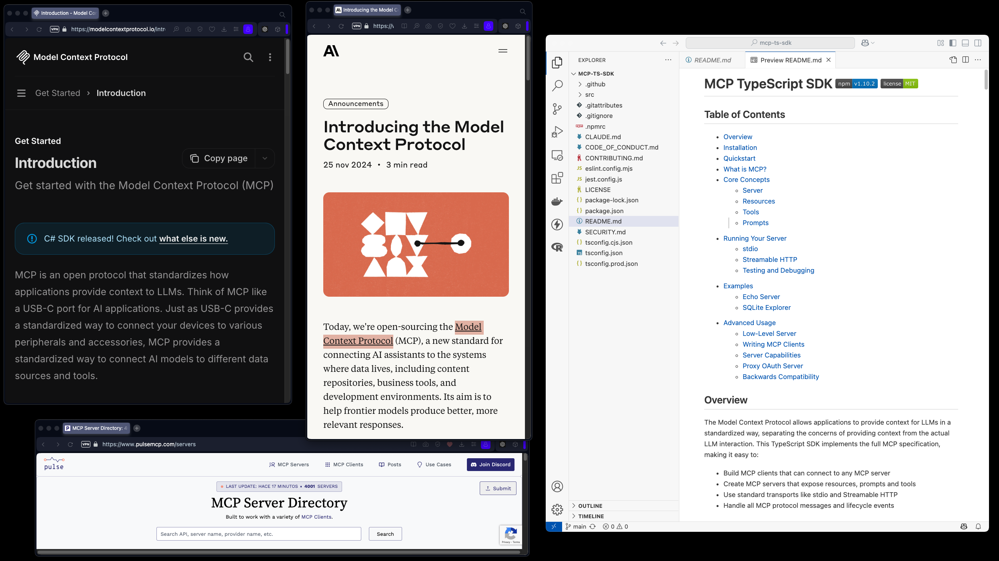
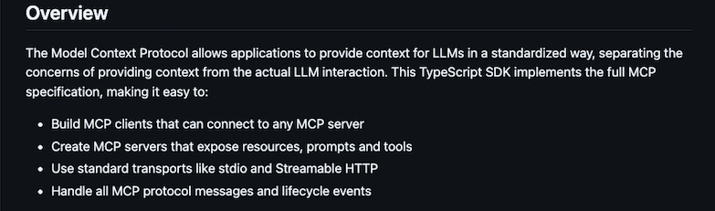
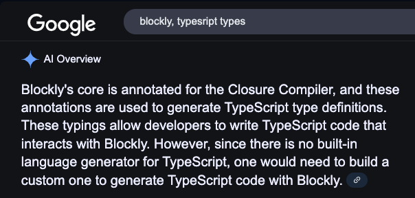

# Codelab: (MCP & Blockly) (+ ¿generador tipado?)

Con caracter eminentemente práctico y de spike (enfangarse con código), el presente Codelab parte de [Codelab: Build a custom generator](https://blocklycodelabs.dev/codelabs/custom-generator/index.html) y se inicializa a partir de un lienzo base Blockly 11 con generador para Javascript:

```bash
npx @blockly/create-package app custom-generator-codelab
```


MCP se propone, desde [Anthropic](https://www.anthropic.com/news/model-context-protocol) a finales del año pasado, a la hora de [modelizar escenas "agentic"](https://modelcontextprotocol.io/introduction) en las que varios autómatas comparten recursos en tareas orquestadas por el usuario. MCP se define como un posible protocolo para crear un primer gran estandar que permita a fabricantes, operadores e ingenieros unificar sus esfuerzos y aprovechar sinergias.



El **objetivo primario** de este codelab es la representación de **MCP mediante una paleta de bloques Blockly**. Una vez sondeada la definción propuesta por Anthropic para el protocolo, identificamos una triple terna de keywords: 
- a) host-clients-servers, 
- b) resources-tools-prompts, 
- c) transport-sampling-roots 

Objetivos secundarios:

- En la parte inferior izquierda de la imagen se observa un [**directorio de MCP Servers**](pulsemcp.com/servers) que, una vez asentado el protocolo, recoge proyectos de la comunidad, crean sus unidades funcionales sabiendo que podrán ser usadas de forma genérica. Será posible encontrar entre ellos unidades de actividad genérica que sería útil modelizar para, junto con sus clientes, crear algunas plantillas patrón.

- De igual modo, se observa `en la parte derecha de la imagen, también es novedad el **[MCP TypeScript SDK](https://github.com/modelcontextprotocol/typescript-sdk)**, recientemente liberado por Anthropic. 




Que también propone algunos  [servers](https://github.com/modelcontextprotocol/typescript-sdk/tree/main/src/server) y [clientes](https://github.com/modelcontextprotocol/typescript-sdk/tree/main/src/client) que tienen esta pinta:

```ts
/**
 * An MCP server on top of a pluggable transport.
 *
 * This server will automatically respond to the initialization flow as initiated from the client.
 *
 * To use with custom types, extend the base Request/Notification/Result types and pass them as type parameters:
 *
 * ```typescript
 * // Custom schemas
 * const CustomRequestSchema = RequestSchema.extend({...})
 * const CustomNotificationSchema = NotificationSchema.extend({...})
 * const CustomResultSchema = ResultSchema.extend({...})
 *
 * // Type aliases
 * type CustomRequest = z.infer<typeof CustomRequestSchema>
 * type CustomNotification = z.infer<typeof CustomNotificationSchema>
 * type CustomResult = z.infer<typeof CustomResultSchema>
 *
 * // Create typed server
 * const server = new Server<CustomRequest, CustomNotification, CustomResult>({
 *   name: "CustomServer",
 *   version: "1.0.0"
 * })
 * ```
 */
export class Server<
	RequestT extends Request = Request,
	NotificationT extends Notification = Notification,
	ResultT extends Result = Result,
> extends Protocol<
	ServerRequest | RequestT,
	ServerNotification | NotificationT,
	ServerResult | ResultT
> {

	private _clientCapabilities?: ClientCapabilities;
	private _clientVersion?: Implementation;
	private _capabilities: ServerCapabilities;
	private _instructions?: string;

  	constructor(/*...*/)

  	(...)
}
```

```ts
/**
 * An MCP client on top of a pluggable transport.
 *
 * The client will automatically begin the initialization flow with the server when connect() is called.
 *
 * To use with custom types, extend the base Request/Notification/Result types and pass them as type parameters:
 *
 * ```typescript
 * // Custom schemas
 * const CustomRequestSchema = RequestSchema.extend({...})
 * const CustomNotificationSchema = NotificationSchema.extend({...})
 * const CustomResultSchema = ResultSchema.extend({...})
 *
 * // Type aliases
 * type CustomRequest = z.infer<typeof CustomRequestSchema>
 * type CustomNotification = z.infer<typeof CustomNotificationSchema>
 * type CustomResult = z.infer<typeof CustomResultSchema>
 *
 * // Create typed client
 * const client = new Client<CustomRequest, CustomNotification, CustomResult>({
 *   name: "CustomClient",
 *   version: "1.0.0"
 * })
 * ```
 */
export class Client<
	RequestT extends Request = Request,
	NotificationT extends Notification = Notification,
	ResultT extends Result = Result,
> extends Protocol<
	ClientRequest | RequestT,
	ClientNotification | NotificationT,
	ClientResult | ResultT
> {
	private _serverCapabilities?: ServerCapabilities;
	private _serverVersion?: Implementation;
	private _capabilities: ClientCapabilities;
	private _instructions?: string;

  	constructor(/*...*/)

  (	...)
}
```

### Puntos clave:

En principio, dentro del SDK deberíamos encontrar todas las herramientas necesarias para nuestro objetivo. Y, siendo un SDK oficial, la modelización de la toolbook podría considerarse como un "parseado" antes que una verdadera creación *ex-nihilo*, de la nada. Quizás, así, podamos usar Copilot para la base.

Es importante, por ejemplo, identificar correctamente los niveles de abstracción para comprender la esencia MCP y aprovecharla en nuestras soluciones, i.e., 
- [MCPServer](https://github.com/modelcontextprotocol/typescript-sdk/blob/747369476ae618b28bf8b6df0b33109dc10f4ad6/src/server/mcp.ts#L54) 
- [Server](https://github.com/modelcontextprotocol/typescript-sdk/blob/747369476ae618b28bf8b6df0b33109dc10f4ad6/src/server/index.ts#L69)
- [Protocol](https://github.com/modelcontextprotocol/typescript-sdk/blob/747369476ae618b28bf8b6df0b33109dc10f4ad6/src/shared/protocol.ts#L161)

... que son las misma entidad en momentos distintos del Modelo OSI, en lejanía o proximidad entre la capa física de transporte y la capa de servicio y aplicación. Igual sucede con MCPClient-Client-Protocol, etc.

### Impedimentos

- Blockly no posee un Generador TS oficial. Y, como objetivo secundario del codelab, podría aspirarse a plantear uno. 

. 

Tras la [transpilación](https://nodejs.org/en/learn/typescript/transpile), typescript se genera como javascript y, por tanto, puede reducirse con el [generador de Javascript](https://github.com/google/blockly/tree/develop/generators/javascript) existente.


