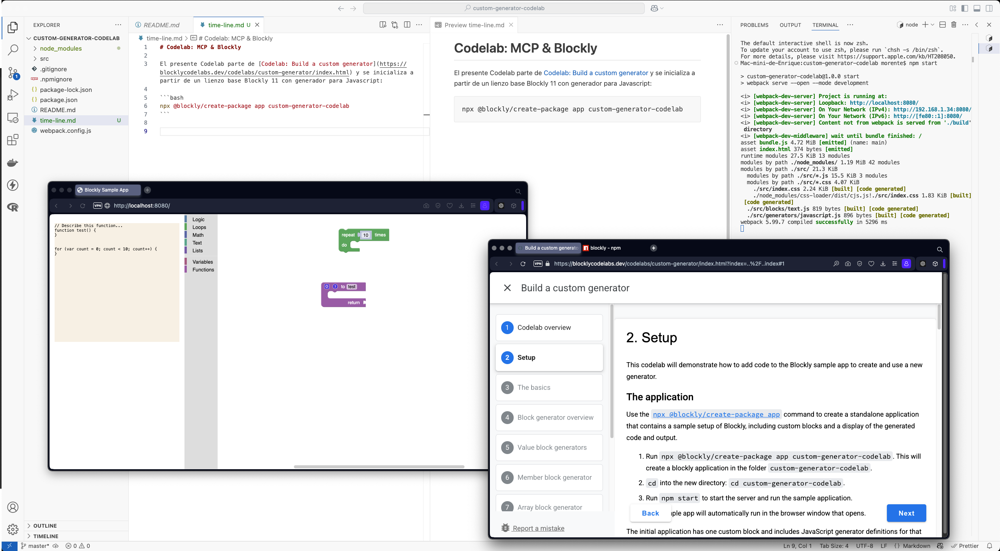
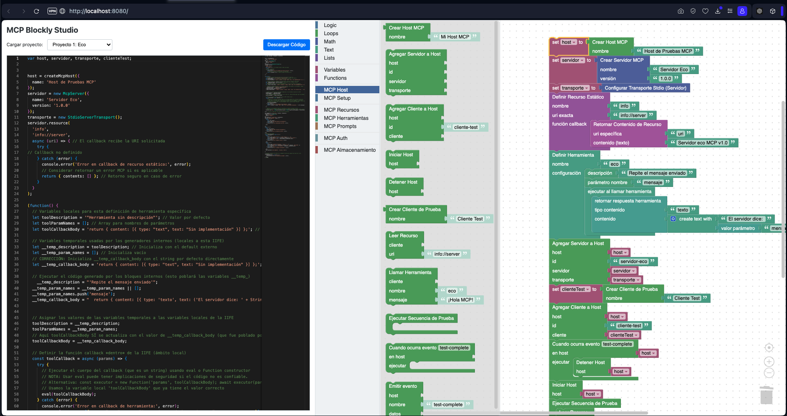

# Codelab: (MCP & Blockly) (+ ¿generador tipado (en previsión?)

Con caracter eminentemente práctico y de spike (enfangarse con código), el presente Codelab parte de [Codelab: Build a custom generator](https://blocklycodelabs.dev/codelabs/custom-generator/index.html) y se inicializa, para **crear un espacio de trabajo**, a partir de un lienzo base Blockly 11 con generador para Javascript. Ver imagen para editor, herramientas y setup:

```bash
npx @blockly/create-package app blockly-mcp-common-palette
```



MCP se propone, desde [Anthropic](https://www.anthropic.com/news/model-context-protocol), a finales del año pasado, a la hora de [modelizar escenas "agentic"](https://modelcontextprotocol.io/introduction) en las que varios autómatas comparten recursos en tareas orquestadas por el usuario. MCP se define como un posible protocolo para crear un primer gran estandar que permita a fabricantes, operadores e ingenieros unificar sus esfuerzos y aprovechar sinergias. 

No necesariamente toda la comunidad adoptará este protocolo. El [libro de recetas de Anthropic](https://github.com/anthropics/anthropic-cookbook/tree/main/patterns/agents) será distinto o parecido al [libro de recetas de OpenAI](https://cdn.openai.com/business-guides-and-resources/a-practical-guide-to-building-agents.pdf), diferencias entre el [SDK de Anthropic](https://github.com/modelcontextprotocol/typescript-sdk) y el [SDK de OpenAI](https://openai.github.io/openai-agents-python/)  equivalen los mismos flujos, y, como en la guerra de las corrientes entre Tesla, Edison y los demás, está abierta la [lucha](https://en.wikipedia.org/w/index.php?title=Removal_of_Sam_Altman_from_OpenAI) (competitiva o cooperativa, que de todo hay) por las patentes, y, escoger un protocolo para la IA no es un caso ajeno a esta disputa.

Actualmente, visitando [la tabla comparativa](https://modelcontextprotocol.io/clients), una de las pocas implementaciones completas de MCP es [fast-agent](https://fast-agent.ai/) en el mundo python. ¿Objetivo terciario un 'fast-agent-ts' para la versión TypeScript?


¿Empezamos?

- [PROMPT_HISTORY/00_write_a_prompt.md](./PROMPT_HISTORY/00_write_a_prompt.md).


### Plan

### Commits on Apr 27, 2025

(reverse order)
-   [After "better editor"](https://github.com/jsanchezamai/blockly-mcp-common-palette/commit/554c1004b469b91080d025cb03df0b05fe849d64)
-   [After "change its (model) mine"](https://github.com/jsanchezamai/blockly-mcp-common-palette/commit/b703dd345edc03d6684ddb5740a83c871c30dbdc)
-   [After "complete tutorials"](https://github.com/jsanchezamai/blockly-mcp-common-palette/commit/dc00bf6abe4888b8903565d60bccdc5533cfe452)
-   [After "lets check the project"](https://github.com/jsanchezamai/blockly-mcp-common-palette/commit/a1216e376f2a23f3e1143c86c4d62733499b6589)
-   [After "start building blocks"](https://github.com/jsanchezamai/blockly-mcp-common-palette/commit/26f9803dc925093e60c54d052daa183817be46ce)
-   [After "tune the toolbox"](https://github.com/jsanchezamai/blockly-mcp-common-palette/commit/b55bf007a679041ea717045f60de64e005a9359c)
-   [After "expand toolbox"](https://github.com/jsanchezamai/blockly-mcp-common-palette/commit/f61f33c5f9a940dbf9534a37b0a4eaaea7b47580)
-   [After "set the end mark"](https://github.com/jsanchezamai/blockly-mcp-common-palette/commit/b5c0ece5f2e941fa647d44fb15bc9a223f5fbe31)
-   [After: "Create a plan"](https://github.com/jsanchezamai/blockly-mcp-common-palette/commit/dd8f3d81efa845bacbc47e178e532adc0ee944ff)
-   [After npx @blockly/create-package app](https://github.com/jsanchezamai/blockly-mcp-common-palette/commit/417846e6fbf414fee8f97cecf5ab1858d596fffe)

### Docs

- [PROMPT_HISTORY/01_create_a_plan.md](./PROMPT_HISTORY/01_create_a_plan.md).  
- [PROMPT_HISTORY/02_create_a_mark_in_the_horizon.md](./PROMPT_HISTORY/02_create_a_mark_in_the_horizon.md)  
- [PROMPT_HISTORY/03_expand_toolbox.md](./PROMPT_HISTORY/03_expand_toolbox.md)  
- [PROMPT_HISTORY/04_inflate_toolbox.md](./PROMPT_HISTORY/04_inflate_toolbox.md)  
- [PROMPT_HISTORY/05_tune_the_toolbox.md](./PROMPT_HISTORY/05_tune_the_toolbox.md)  
- [PROMPT_HISTORY/06_building_blocks.md](./PROMPT_HISTORY/06_building_blocks.md)  

### Meta Volante 1

- [PROMPT_HISTORY/07_lets_check_the_project.md](./PROMPT_HISTORY/07_lets_check_the_project.md)

### Otras metas

- [PROMPT_HISTORY/08_complete_tutorials.md](./PROMPT_HISTORY/08_complete_tutorials.md)
- [PROMPT_HISTORY/09_change_its_mine.md](./PROMPT_HISTORY/09_change_its_mine.md)
- [PROMPT_HISTORY/10_follow_up_better_editor.md](./PROMPT_HISTORY/10_follow_up_better_editor.md)

### Last sprint

v001:



